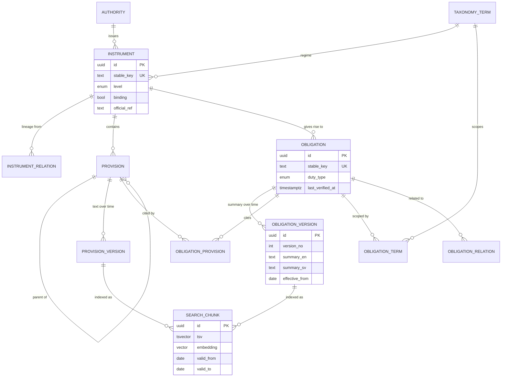
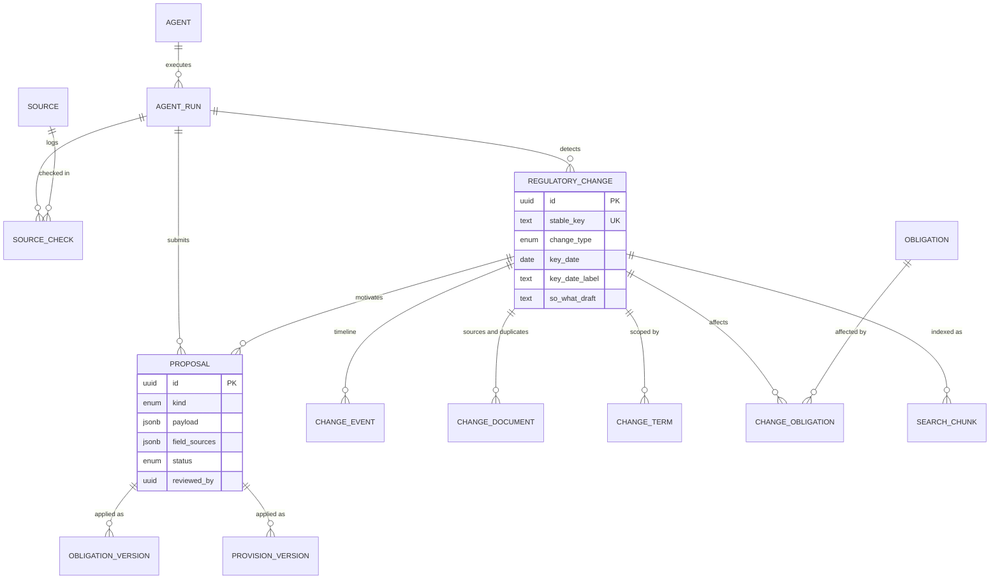
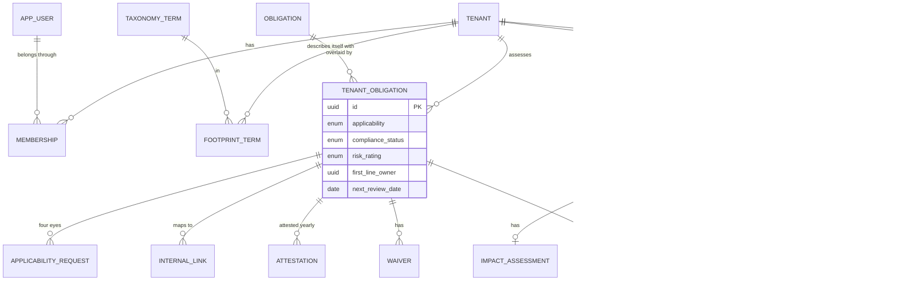
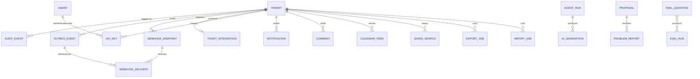
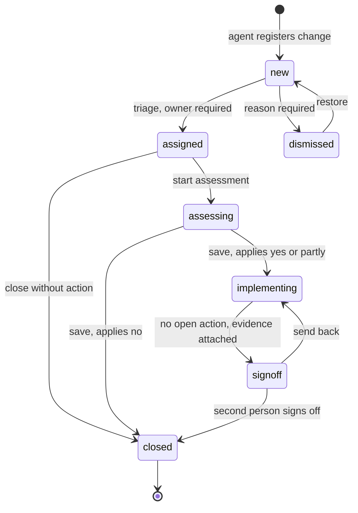

# Compliance Watch: data model

Version 0.3, 19 September 2026. Companion to `schema.sql` (runnable DDL) and `openapi.yaml`. Derived from the latest prototype ("bleqq: compliance inventory and watch") and the journey and capability list in the Compliance Watch chat.

121 tables, 57 enumerations, 3 views and 2 matching functions. Version 0.1 had 53 tables and modelled the prototype and its workflows. Version 0.2 adds 64 tables after a review of what a running platform and a real register need, described in section 8. The DDL was run on PostgreSQL 16 with pgvector. Every table with a `tenant_id` has a row-level security policy, and the footprint rule, the four-eyes constraints, the append-only audit log, the views and Swedish stemming were smoke tested.

## 1. Principles

- **Facts and judgement live apart.** The library zone holds sourced public facts and has no `tenant_id`. The tenant zone holds applicability, compliance status, cases and evidence, with `tenant_id` and row-level security on every table. This is the rule from the chat ("the inventory holds sourced facts only") turned into the tenancy boundary.
- **Proposals are the only door into the library.** Agents and people both write to `proposal`. Approval applies the payload, creates the new version and writes the audit event in one transaction.
- **Nothing is overwritten.** Legal text and obligation summaries are versioned with effective dates, which is what makes "as of" search and "show what changed" possible.
- **"Applies" and "we comply" are separate columns**, so a gap can never hide behind an applicability flag.
- **Stable keys never change.** `instrument.stable_key`, `provision.stable_key`, `obligation.stable_key` and `regulatory_change.stable_key` are what other agents, such as a requirements agent, point at.
- **The audit log is part of phase 1.** It is append-only by trigger, and every service writes to it in the same transaction as the change it describes.

## 2. Entity relationship diagrams

### 2.1 Library: inventory

### 2.2 Library: watch and proposals

### 2.3 Tenant: footprint, register and case workflow

### 2.4 Platform: audit, AI governance, integration

## 3. Table dictionary

| Table | Zone | Phase | Purpose |
| --- | --- | --- | --- |
| `tenant` | Tenant | 1 | Company, region and settings (reminders, escalation, retention). |
| `app_user` | Platform | 1 | Person. Sign-in is delegated to an OIDC provider, `platform_roles` holds `library_editor`. |
| `membership` | Tenant | 1 | User in a tenant with roles, title, notification preferences and last visit. |
| `agent` | Library | 1 | A research, backfill or re-verify agent. |
| `agent_run` | Library | 1 | One execution with model and pipeline version. The provenance anchor for everything an agent writes. |
| `api_key` | Both | 1 | Hashed key with narrow scopes. `tenant_id` null means a platform key for agents. |
| `taxonomy_term` | Library | 1 | One table for all seven scope dimensions: regime, account type, legal entity, service type, client category, channel, lifecycle stage. |
| `footprint_term` | Tenant | 1 | What the company is and does. Filters the feed and the inventory. |
| `authority` | Library | 1 | FI, ESMA, Skatteverket, IMY and so on. |
| `instrument` | Library | 1 | A legal instrument with level, binding flag, official reference and in-force dates. |
| `instrument_relation` | Library | 1 | Lineage: implements, elaborates, amends, replaces, delegated under. |
| `provision` | Library | 1 | The legal structure as a tree. Its `path` is carried into search chunks. |
| `provision_version` | Library | 1 | Verbatim text in Swedish and English with in-force dates and transitional notes. |
| `obligation` | Library | 1 | A plain-language duty: type, trigger, retention, sanction exposure, provenance. |
| `obligation_version` | Library | 1 | The summary shown on the obligation page, per effective date, linked to the change and proposal that caused it. |
| `obligation_provision` | Library | 1 | Which provisions an obligation rests on. |
| `obligation_term` | Library | 1 | Scope facets of an obligation. |
| `obligation_relation` | Library | 1 | Related obligations, guidance that elaborates a rule, enforcement precedents. |
| `source` | Library | 1 | The source registry, including the open web sweep. |
| `source_check` | Library | 1 | Coverage log. Answers "how do you know you missed nothing". |
| `regulatory_change` | Library | 1 | What happened, one row per reform, with the one key date that drives "coming up". |
| `change_event` | Library | 1 | Timeline from consultation to in force. Dates can be missing or partial. |
| `change_document` | Library | 1 | Source pages, duplicates merged in, and flags from the prompt injection screen. |
| `change_term` | Library | 1 | Regimes, accounts and services a change touches. |
| `change_obligation` | Library | 1 | Obligations affected, with the agent's confidence and who confirmed the link. |
| `proposal` | Library | 1 | The review queue. Payload, a source per field, reviewer and four-eyes check. |
| `search_chunk` | Library | 1 | One row per legal unit per language with a generated `tsvector`, an embedding, model name and version, and validity dates. |
| `saved_search` | Tenant | 3 | Saved queries with optional notification. |
| `tenant_obligation` | Tenant | 2 | The register overlay: applicability, compliance status, risk, owners, process, system, evidence location, next review. |
| `applicability_request` | Tenant | 2 | Four-eyes on applicability. One pending request per obligation. |
| `internal_link` | Tenant | 2 | Linked policies, procedures and controls. Deliberately shallow, per the decision to integrate with GRC tools. |
| `attestation` | Tenant | 3 | Yearly confirmation by the obligation owner. |
| `waiver` | Tenant | 3 | Time-limited exceptions. |
| `change_case` | Tenant | 1 and 2 | The tenant's work on one change: status, urgency, owner, So what, dismissal, sign-off. |
| `impact_assessment` | Tenant | 2 | Applies, why, what must change, internal deadline, effort, contributors. |
| `action` | Tenant | 2 | Owner, due date, done state and the ticket it was exported to. |
| `evidence` | Tenant | 2 | File, link or reference on a case or an obligation. Files sit in the private bucket. |
| `comment` | Tenant | 2 | Comments and mentions on any record. |
| `briefing`, `briefing_item` | Tenant | 1 | Snapshot of the weekly briefing as it was emailed. |
| `calendar_feed` | Tenant | 1 | Tokenised ICS subscription, filtered to all, regulatory or internal dates. |
| `notification` | Tenant | 2 | Assignments, mentions, approvals, reminders and escalations. |
| `outbox_event` | Both | 1 | Domain events written with the change. Feeds the worker. |
| `webhook_endpoint`, `webhook_delivery` | Tenant | 3 | Outbound webhooks with delivery log. |
| `ticket_integration` | Tenant | 3 | The tenant's work tracker. |
| `export_job`, `import_job` | Tenant | 3 | Case file, committee pack and inventory exports, and the spreadsheet register import. |
| `audit_event` | Both | 1 | Append-only log with actor, action, subject, summary and before and after values. |
| `ai_generation` | Both | 1 | Everything a model produced, including Ask answers with citations and feedback. |
| `problem_report` | Both | 1 | The "this looks wrong" button, optionally resolved by a proposal. |
| `eval_question`, `eval_run` | Library | 3 | The search evaluation set and its scored runs. |

Views: `v_upcoming` (public dated changes, read by the app, the newsletter agent and the calendar feed) and `v_roadmap_item` (regulatory dates plus internal deadlines, action due dates and reviews due).

## 4. Rules the schema enforces or assumes

**Versioning and "as of".** The version in force on date D is the one with the latest `effective_from` that is null or on or before D. `search_chunk.valid_from` and `valid_to` are copied from the version so search can filter by date without a join. A change about to take effect shows up as a second version with a future `effective_from`, exactly like version 2 of the research payment obligation in the prototype.

**Footprint matching.** For every dimension where a record carries terms, at least one term must be in the footprint. A dimension with no terms does not restrict. Obligations also need their instrument's regime in the footprint. Implemented as `change_in_footprint()` and `obligation_in_footprint()`, and cached on `change_case.footprint_match`, which is recomputed when the footprint or the change scope moves.

**Four eyes.** Three places, each with a database check: `applicability_request.decided_by <> requested_by`, `change_case.signed_off_by <> signoff_requested_by`, and `proposal.reviewed_by <> proposed_by_user`. Agent proposals always satisfy the rule because a person reviews them.

**Case status machine.**

Check constraints back the two transitions that matter most to an auditor: a dismissal needs a reason, and any status past triage needs an owner. The rest of the machine lives in the case workflow service.

**Partial and missing dates.** Dates such as "December 2025" are stored as the first day of the period plus a `date_precision`. Timeline events may have no date at all.

**Search indexing.** `tsv` is generated with the Swedish or English configuration depending on `lang`. The embedding column is `vector(1024)`. Set it to the dimension of the multilingual model you choose and keep it under 2,000, which is the HNSW limit for the `vector` type in pgvector. Model name and version are stored per row so the corpus can be re-embedded later.

**Audit.** `audit_event` rejects UPDATE and DELETE by trigger. The application role should also have those privileges revoked. `subject_label` stores the title at the time, so the log reads on its own, as it does in the prototype.

**AI labelling.** `change_case.so_what_confirmed = false` means the text is still the agent's draft and must be shown as "Drafted by AI". Every generated text has a row in `ai_generation` with model and review state.

## 5. Prototype field to column mapping

| Prototype field | Column |
| --- | --- |
| `instrument.short`, `name`, `regime`, `level`, `binding`, `official`, `implements` | `instrument.short_name`, `name`, `regime_term_id`, `level`, `binding`, `official_ref`, `implements_note` plus `instrument_relation` |
| `obligation.ref`, `title`, `tags` | `obligation.ref_label`, `title`, `tags` |
| `obligation.accounts`, `entity`, `service`, `client`, `channel`, `stage` | `obligation_term` rows in six dimensions |
| `obligation.product`, `duty`, `trigger`, `retention`, `sanction` | `obligation.product_scope`, `duty_type`, `trigger_frequency`, `retention`, `sanction_exposure` |
| `obligation.versions[n, from, en, sv]` | `obligation_version.version_no`, `effective_from`, `summary_en`, `summary_sv` |
| `obligation.related` | `obligation_relation` |
| `obligation.createdBy`, `model`, `verifiedBy`, `verified` | `obligation.created_origin`, `created_by_agent_run`, `created_model`, `verified_by`, `last_verified_at` |
| `obligation.applies`, `reason`, `pendingApplies` | `tenant_obligation.applicability`, `applicability_reason`, `applicability_request` |
| `obligation.status`, `statusNote`, `risk`, `review` | `tenant_obligation.compliance_status`, `status_note`, `risk_rating`, `next_review_date` |
| `obligation.owner`, `second`, `process`, `system`, `evidence` | `tenant_obligation.first_line_owner`, `compliance_contact`, `process`, `system`, `evidence_location` |
| `obligation.internal[]` | `internal_link` |
| `change.type`, `title`, `authority`, `published`, `summary`, `flags`, `source` | `regulatory_change.change_type`, `title`, `authority_label`, `published_on` with precision, `summary`, `flags`, `source_label`, `source_url` |
| `change.keyDate`, `keyLabel` | `regulatory_change.key_date`, `key_date_label` |
| `change.timeline[label, date, done]` | `change_event.label`, `event_date`, `occurred` |
| `change.regimes`, `accounts`, `services` | `change_term` |
| `change.obligations[]` | `change_obligation` |
| `change.dupes` | count of `change_document` where `is_duplicate` |
| `change.week` | `change_case.briefing_week`, snapshotted in `briefing_item` |
| `change.status`, `urgency`, `owner` | `change_case.status`, `urgency`, `owner_id` |
| `change.sowhat{text, confirmed}` | `regulatory_change.so_what_draft`, then `change_case.so_what_text`, `so_what_confirmed` |
| `change.assessment{...}` | `impact_assessment` |
| `change.actions[]`, `evidence[]` | `action`, `evidence` |
| `change.requestedBy`, `signedBy`, `closedAt`, `closedNote`, `dismissedReason`, `dismissedBy` | matching columns on `change_case`, plus `close_reason` |
| `proposals[kind, target, title, source, effective, en, sv, scope, status]` | `proposal.kind`, `target_id`, `title`, `source_label`, `source_url`, `effective_from`, `payload`, `status` |
| `sources[name, checked, status]` | `source` and the latest `source_check` |
| `audit[t, u, a, o]` | `audit_event.occurred_at`, actor columns, `summary`, `subject_label` |
| `footprint{regimes, accounts, entities, services, clients}` | `footprint_term` |
| `USERS[id, name, role]` | `app_user`, `membership.roles`, `membership.title` |

Prototype change types map to the enum as follows: Adopted rule to `adopted`, EU proposal to `proposal`, EU legislation and EU regulation to `adopted` or `in_force` depending on the timeline, Supervision to `supervision`, Enforcement to `enforcement`, Recurring date to `recurring_date`. Whether a change is EU or Swedish comes from its authority, not from the type.

## 6. Modelled beyond the prototype

These come from the capability list in the chat and have no screen yet: provision-level legal text (`provision`, `provision_version`), structured lineage (`instrument_relation`), agent runs and the AI output log, comments and mentions, notifications with reminders and escalation, saved searches, the "what changed since my last visit" bookmark, attestations, waivers, webhooks, ticket integration, exports and imports, retention settings and the search evaluation set.

## 7. Assumptions to confirm

1. **Shared library, tenant overlay.** The design assumes this becomes a product with several companies on one library. If it stays a single-company tool the same schema works with one tenant row, and nothing needs to be removed.
2. **Who approves library proposals.** A platform role, `library_editor`. In a single-company setup the compliance officer simply holds it as well.
3. **So what is per tenant.** The agent drafts one generic text on the change, and each tenant confirms or rewrites its own copy.
4. **Tenant content is not searched in version 1.** Search covers the library only. Assessments and comments can be added as tenant-scoped chunks later.
5. **Embedding dimension 1024** is a placeholder until the model is chosen.

## 8. Review of version 0.1 and what version 0.2 adds

**Verdict.** Version 0.1 was complete for what the prototype shows and thin everywhere else. It answered "what does each screen need" and not "what does a company need to run on this, and what do we need to run it as a business". Six gaps, in order of how much they matter.

### 8.1 The gaps

1. **The tenant had no organisation.** Legal entity was a tag, and process, system and policy were free text typed per obligation. A bank and its insurer differ on whether a rule applies and whether they comply, and a policy linked to ten obligations was ten strings. Added: `org_unit`, `licence`, `tenant_product` with scope terms, one `internal_item` register, `tenant_obligation_scope` for applicability and status per entity or product, `team` ownership that survives a person leaving.
2. **Compliance status had no history and a gap was a note.** Status was overwritten, so no trend and no record of who assessed what on which basis. Added: `compliance_assessment` (method, rationale, likelihood, impact, approver), `gap` as a record with severity, owner, target date and four-eyes on risk acceptance, `interpretation` for the company's approved reading of a rule, `requirement_status`, and actions and evidence that can hang on a gap or a duty and not only on a change.
3. **The library was shallow on the things that make it trustworthy.** A source was a URL that can move or vanish, per-field sources died with the proposal, and only the latest verification date survived. Added: `source_document` with stored snapshots, `citation` per field on the live record, `verification` history. Also `initiative` to group one reform's many changes, `change_relation`, structured `enforcement_decision` and `consultation`, `obligation_requirement`, `obligation_exemption`, `recurring_duty` for dated duties the law repeats, `jurisdiction`, a `glossary_term` table that replaces the prototype's hard-coded synonym list, and four new scope dimensions: jurisdiction, theme, product type and licensed activity.
4. **Account, identity and security were one table each.** Added: company details, status and trial on `tenant`, a real profile on `app_user`, `invitation`, `tenant_domain`, `identity_provider` with SCIM, `user_session`, `login_event`, out-of-office delegation, `legal_document` and `legal_acceptance`, `support_access` so a tenant sees every time platform staff enter its data, `data_subject_request`, `legal_hold`, `retention_run`.
5. **There was nothing to run it as a business.** Added: `plan`, `tenant_subscription`, `invoice`, `usage_record`, `feature_flag`, `tenant_feature`. Card data stays with the payment provider.
6. **No feedback or analytics at all.** Added: `usage_event`, `search_query_log` (zero-result queries and clicks feed the evaluation set), `content_feedback` on any AI or library text, `feedback` for bugs, ideas and NPS, `tenant_metric_daily` for trends, `email_message` as proof that a reminder or escalation was sent, `job_run`, token and cost columns on `agent_run` and `ai_generation`, a rejection code on proposals, `prompt_template`, and the view `v_agent_quality` with acceptance rate and review time per agent and model.

Smaller additions: `case_transition` for time in stage, a triage due time, `assessment_impact` and `assessment_contribution` in place of one text box and a list of names, `consultation_response`, `follow` and `user_item_state` for a personal watchlist and read state, `footprint_history`, tags and custom fields, `newsletter_issue`, and `idempotency_record` behind the API header.

### 8.2 New tables by area

| Area | Tables | Count |
| --- | --- | --- |
| Account, identity, security | `tenant_domain`, `identity_provider`, `invitation`, `user_session`, `login_event`, `team`, `team_member`, `legal_document`, `legal_acceptance`, `support_access`, `data_subject_request`, `legal_hold`, `retention_run` | 13 |
| Plans and usage | `plan`, `tenant_subscription`, `invoice`, `usage_record`, `feature_flag`, `tenant_feature` | 6 |
| Tenant organisation | `org_unit`, `licence`, `tenant_product`, `tenant_product_term`, `internal_item`, `custom_field_def`, `tenant_tag`, `tagging`, `footprint_history` | 9 |
| Library depth | `jurisdiction`, `initiative`, `initiative_instrument`, `change_relation`, `source_document`, `citation`, `verification`, `glossary_term`, `obligation_requirement`, `obligation_exemption`, `recurring_duty`, `enforcement_decision`, `consultation`, `newsletter_issue`, `newsletter_item`, `prompt_template` | 16 |
| Tenant compliance depth | `tenant_obligation_scope`, `compliance_assessment`, `requirement_status`, `gap`, `interpretation`, `duty_occurrence`, `consultation_response`, `assessment_impact`, `assessment_contribution`, `case_transition`, `follow`, `user_item_state` | 12 |
| Feedback, analytics, delivery | `usage_event`, `search_query_log`, `content_feedback`, `feedback`, `tenant_metric_daily`, `email_message`, `job_run`, `idempotency_record` | 8 |

Existing tables changed: `tenant`, `app_user`, `membership`, `tenant_obligation`, `change_case`, `internal_link`, `action`, `evidence`, `regulatory_change`, `change_document`, `provision_version`, `proposal`, `agent_run`, `ai_generation`, `authority`, `instrument`. The roadmap view now also carries gap target dates, recurring duties and actions on gaps.

By phase the schema is now 58 tables in phase 1, 43 in phase 2 and 16 in phase 3.

### 8.3 Deliberately not in this database

- **Passwords and card numbers.** Sign-in is delegated to an identity provider and payment to a payment provider.
- **Raw request logs, traces and errors.** They belong in the logging stack. The database keeps what has audit or product value: logins, sessions, job runs, emails, usage events.
- **Third-party trackers.** Analytics is first-party and server-side, tied to signed-in users, with nothing extra stored in the browser. It is still personal data under GDPR, so it needs a line in the privacy notice and a retention period, set here to 13 months before aggregation.
- **Controls testing, policy lifecycle, incidents, training.** Still out of scope by the decision in the chat. `internal_item` is a register to link to, not a GRC module.
- **Regulator correspondence.** Information requests from a supervisor can run as a case today. A dedicated table is worth adding only if customers ask for it.

### 8.4 A caution that still holds

More tables is not more product. The chat's warning that a register with forty mandatory fields dies of neglect applies here too. Almost everything added in the compliance areas is optional per obligation: requirements, exemptions, scopes per entity, interpretations. A small firm can run on `tenant_obligation` alone, and a group with a bank and an insurer can go as deep as it needs.

## 9. Version 0.3: tenant-scoped agents and private records

Agents can no longer be assumed to run under one operator's account, so the model now separates what the platform owns from what a tenant controls.

| Table or change | Zone | Purpose |
| --- | --- | --- |
| `agent` gains `scope`, `tenant_configurable`, `runtime`, `default_cadence`, `writes_to` | Library | Whether an agent is a platform agent or one a tenant can switch on, and where its output goes. |
| `agent_version` | Library | Versioned model, instructions and tools, with the id of the definition in the runtime. Tenants get a version and never edit it. |
| `tenant_agent` | Tenant | What the tenant admin controls: on or off, cadence, scope, monthly budget, pinned version, pause, and whether runs execute in Anthropic's cloud or a self-hosted sandbox. |
| `research_request` | Tenant | "Run now", "check this source", "research this topic". Queued and capped per plan. |
| `source_request` | Tenant | A tenant asks for a source, private to them at once or shared after a library editor approves it. |
| `agent_run` gains `tenant_id`, `tenant_agent_id`, `agent_version_id`, `trigger`, `research_request_id`, `requested_by`, `external_session_id`, `budget_limit`, `interrupted_at` | Both | A run is traceable to who triggered it, which version made it, and what it cost. A null tenant means a platform run for the shared library. |
| `owner_tenant_id` on `source`, `regulatory_change`, `instrument`, `obligation` | Library | Tenant-private library records. The row-level rule is "shared or mine". |

The app stays the scheduler of record. `tenant_agent.next_run_at` is what the worker polls, and the agent runtime is an executor that can be swapped without touching the data.

Prototype screens added for this version and for section 8: Agents, Gaps, per-entity status, assessment history and interpretation on the obligation page, and legal entities and products under Settings.
