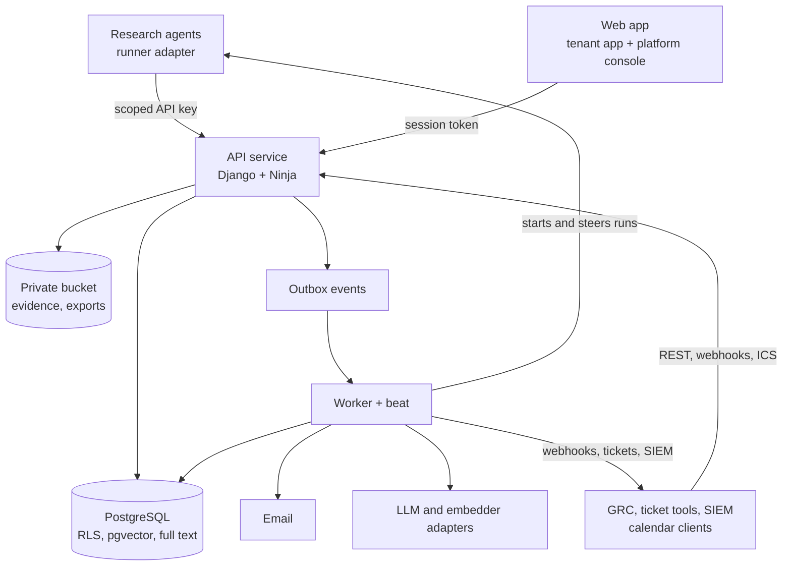

# Solution design

Version 0.2, 2026-09-19. Supersedes the service description from the
Compliance Data chat where they differ. Detail lives in `docs/inputs/` as
corrected by `INPUT_DELTAS.md`. The agent extends this file at each
architectural change.

## Architecture at a glance

A modular monolith: one API service, one worker with beat, one web app, one
PostgreSQL with pgvector, Redis, one private bucket. All in one EU region.
Agents run outside and reach the API with scoped keys.

Every write lands with its audit event and outbox event in one transaction.
The worker does everything slow: embeddings, notifications, reminders,
webhooks, exports, imports, agent runs. One database is deliberate: a new
text is visible to keyword and vector search in the same commit, and an
inventory edit cannot exist without its audit row.

## Zones

Library (shared facts, proposal-only writes) and tenant (judgement and work
under row-level security). See playbook 14. The split also answers hosting:
the tenant zone can move into a bank's environment without touching the
library or the agents.

## Modules

| App | Owns | Zone | Release |
|---|---|---|---|
| `identity` | Users, invitations, codes, passkeys, challenges, sessions, step-up, API keys, permissions, roles, security log | Both | R1 |
| `tenants` | Tenant, membership, legal entities, products, teams, delegation, security policy, support access | Tenant | R1, R2 |
| `taxonomy` | The `Vocabulary` base, library and tenant vocabularies, tags, footprint and its change requests, matching functions | Both | R1 |
| `library` | Jurisdictions, languages, authorities, instruments, lineage, provisions, obligations, versions, translations | Library | R1 |
| `proposals` | The review queue and `apply` | Library | R1 |
| `watch` | Sources, coverage, changes, timelines, documents, obligation links | Library | R1 |
| `register` | Tenant obligation overlay per entity, applicability requests, gaps, assessment history, internal links, attestations, waivers | Tenant | R2 |
| `cases` | Case, assessment, actions, evidence, sign-off, case file | Tenant | R1 (new + match), R2 |
| `search` | Chunks, hybrid query, Ask, saved searches, evaluation sets | Library | R1 |
| `home` | Home, briefing, roadmap, upcoming, calendar feeds | Tenant | R1 |
| `collab` | Comments, notifications, reminders, escalation, follows | Tenant | R2 |
| `agents` | Definitions and versions, tenant settings, schedules, research requests, runs, budgets | Both | R1 (API), R2 |
| `reports` | Dashboards, committee pack, exports, imports, tenant exit | Tenant | R3 |
| `integrations` | Outbox delivery, webhooks, tickets, SIEM stream | Tenant | R3 |
| `governance` | Audit events, AI output log, problem reports, retention | Both | R1 |
| `billing` | Plans, limits, usage | Platform | R3 |

A module reads another module's tables through its `logic.py` interface and
never writes to them.

## Key mechanics

- **Agent finding to inventory.** Open run, log a source check per source,
  `POST /search/similar`, register the change idempotently, submit proposals,
  close the run. A change lands in triage, where a person decides. An
  inventory edit is only ever a proposal.
- **Triage to sign-off.** `new`, `assigned`, `assessing`, `implementing`,
  `signoff`, `closed`, with `dismissed` as a restorable side exit. Guards:
  owner on triage, reason on dismissal, a why on the assessment, no open
  action and at least one piece of evidence before sign-off, a second person
  with step-up to close. Closing a case never edits the inventory.
- **"As of".** The version in force on date D has the latest effective date on
  or before D. Chunks copy validity dates so search filters without a join.
- **Footprint matching.** For every dimension where a record carries terms,
  at least one must be in the footprint. A dimension with no terms does not
  restrict. Cached on the case, recomputed when either side moves.
- **Hybrid search.** Full text in the chunk's language plus pgvector, fused
  by reciprocal rank, reranked over the top 50, filtered by validity before
  ranking. One SQL statement, one table.
- **Vocabulary read.** `GET /vocab/{list}` serves pickers, filters, the pill
  presentation and the agents from the same rows.

## Control mapping

| Control | Where it lives |
|---|---|
| Tenant isolation | RLS policies in migrations, `tenancy.py`, guards in playbook 5 |
| Four eyes | Check constraints, `@requires_step_up`, 409 `four_eyes_violation` |
| Audit | `apps/shared/audit.py`, append-only trigger, audit-on-write guard |
| No passwords | `identity`, enrolment-only session, the guard that no usable password exists |
| Library integrity | `LibraryModel`, `library_write()`, the library fence guard, API key scopes |
| AI governance | Adapters, `ai_generation`, labels until confirmed, evaluation gate |
| Design fidelity | `Pill`, presentation functions, the pill gallery screenshot, contrast test |
