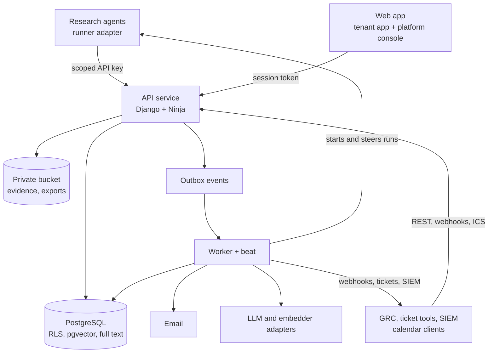

# Solution design

Version 0.2, 2026-09-19. Supersedes the service description from the
Compliance Data chat where they differ. Detail lives in `docs/inputs/` as
corrected by `INPUT_DELTAS.md`. The agent extends this file at each
architectural change.

## Architecture at a glance

A modular monolith: one API service, one worker with beat, one web app, one
PostgreSQL with pgvector, Redis, one private bucket. All in one EU region.
Agents run outside and reach the API with scoped keys.



Every write lands with its audit event and outbox event in one transaction.
The worker does everything slow: embeddings, notifications, reminders,
webhooks, exports, imports, agent runs. One database is deliberate: a new
text is visible to keyword and vector search in the same commit, and an
inventory edit cannot exist without its audit row.

## Zones

Library (shared facts, proposal-only writes) and tenant (judgement and work
under row-level security). See playbook 14. The split also answers hosting:
the tenant zone can move into a bank's environment without touching the
library or the agents.

## Modules

| App | Owns | Zone | Release |
|---|---|---|---|
| `identity` | Users, invitations, codes, passkeys, challenges, sessions, step-up, API keys, permissions, roles, security log | Both | R1 |
| `tenants` | Tenant, membership, legal entities, products, teams, delegation, security policy, support access | Tenant | R1, R2 |
| `taxonomy` | The `Vocabulary` base, library and tenant vocabularies, tags, footprint and its change requests, matching functions | Both | R1 |
| `library` | Jurisdictions, languages, authorities, instruments, lineage, provisions, obligations, versions, translations | Library | R1 |
| `proposals` | The review queue and `apply` | Library | R1 |
| `watch` | Sources, coverage, changes, timelines, documents, obligation links | Library | R1 |
| `register` | Tenant obligation overlay per entity, applicability requests, gaps, assessment history, internal links, attestations, waivers | Tenant | R2 |
| `cases` | Case, assessment, actions, evidence, sign-off, case file | Tenant | R1 (new + match), R2 |
| `search` | Chunks, hybrid query, Ask, saved searches, evaluation sets | Library | R1 |
| `home` | Home, briefing, roadmap, upcoming, calendar feeds | Tenant | R1 |
| `collab` | Comments, notifications, reminders, escalation, follows | Tenant | R2 |
| `agents` | Definitions and versions, tenant settings, schedules, research requests, runs, budgets | Both | R1 (API), R2 |
| `reports` | Dashboards, committee pack, exports, imports, tenant exit | Tenant | R3 |
| `integrations` | Outbox delivery, webhooks, tickets, SIEM stream | Tenant | R3 |
| `governance` | Audit events, AI output log, problem reports, retention | Both | R1 |
| `billing` | Plans, limits, usage | Platform | R3 |

A module reads another module's tables through its `logic.py` interface and
never writes to them.

## Key mechanics

- **Agent finding to inventory.** Open run, log a source check per source,
  `POST /search/similar`, register the change idempotently, submit proposals,
  close the run. A change lands in triage, where a person decides. An
  inventory edit is only ever a proposal.
- **Triage to sign-off.** `new`, `assigned`, `assessing`, `implementing`,
  `signoff`, `closed`, with `dismissed` as a restorable side exit. Guards:
  owner on triage, reason on dismissal, a why on the assessment, no open
  action and at least one piece of evidence before sign-off, a second person
  with step-up to close. Closing a case never edits the inventory.
- **"As of".** The version in force on date D has the latest effective date on
  or before D. Chunks copy validity dates so search filters without a join.
- **Footprint matching.** For every dimension where a record carries terms,
  at least one must be in the footprint. A dimension with no terms does not
  restrict. Cached on the case, recomputed when either side moves.
- **Hybrid search.** Full text in the chunk's language plus pgvector, fused
  by reciprocal rank, reranked over the top 50, filtered by validity before
  ranking. One SQL statement, one table.
- **Vocabulary read.** `GET /vocab/{list}` serves pickers, filters, the pill
  presentation and the agents from the same rows.

## Control mapping

| Control | Where it lives |
|---|---|
| Tenant isolation | RLS policies in migrations, `tenancy.py`, guards in playbook 5 |
| Four eyes | Check constraints, `@requires_step_up`, 409 `four_eyes_violation` |
| Audit | `apps/shared/audit.py`, append-only trigger, audit-on-write guard |
| No passwords | `identity`, enrolment-only session, the guard that no usable password exists |
| Library integrity | `LibraryModel`, `library_write()`, the library fence guard, API key scopes |
| AI governance | Adapters, `ai_generation`, labels until confirmed, evaluation gate |
| Design fidelity | `Pill`, presentation functions, the pill gallery screenshot, contrast test |

## Phase 0 mechanics

Added 2026-09-19 at the end of Phase 0. What exists after Phase 0 is the
floor every app builds on; no domain table exists yet.

### Two database roles, and how tests use them

`cw_migrator` owns the schema and runs migrations; `cw_app` runs the
application with no ownership and no `BYPASSRLS` (ADR 0022;
`infra/db/init.sql` locally, the role script in `RAILWAY_DEPLOY.md` in
production). The app reads `DATABASE_URL` (cw_app) and the entrypoint reads
`MIGRATOR_DATABASE_URL` (cw_migrator). The boot guard
(`apps/shared/db_role_guard.py`) queries `pg_roles` and table ownership for
the connected role and refuses to start on a superuser, an owner or a
`BYPASSRLS` role.

Tests keep both roles honest: `config/test_settings.py` creates the
throwaway database as `cw_migrator` (which is why that role has `CREATEDB`
locally and in CI, and never in production) and runs the test client as
`cw_app`, so a policy that is missing or not forced shows up as a failing
isolation test rather than as a passing one. `migrate_from_zero` does the
same for the migration graph. Extensions live in `template1` so every
throwaway database inherits `vector`, `citext` and `pg_trgm`.

### The RLS policy shape

Every tenant table is created with `ENABLE ROW LEVEL SECURITY` and
`FORCE ROW LEVEL SECURITY` in a `RunSQL` migration with reverse SQL, and one
policy of this shape:

```sql
CREATE POLICY tenant_isolation ON <table>
  USING (tenant_id = current_setting('app.tenant_id', true)::uuid)
  WITH CHECK (tenant_id = current_setting('app.tenant_id', true)::uuid);
```

`current_setting(..., true)` returns NULL when nothing was set, and NULL
matches no row, so an unactivated connection sees nothing. Mixed tables
(`audit_event`, `ai_generation`, `problem_report`, `outbox_event`, `api_key`)
use `tenant_id IS NULL OR tenant_id = current_setting(...)`, and
tenant-private library records use the same "shared or mine" shape on
`owner_tenant_id`. `ATOMIC_REQUESTS = True`; after authentication resolves
the membership, `tenancy.activate(tenant_id)` issues `SET LOCAL
app.tenant_id`, which dies with the transaction. Worker tasks get the same
through `@tenant_task`, which takes the tenant id explicitly and activates
it inside its own transaction. The RLS guard reads `pg_class` and
`pg_policies` for every model with a tenant foreign key.

### `record()`

`apps/shared/audit.py` exposes one function. It takes the actor (user, agent
or system), the action, the subject (kind, id and its title at the time), a
summary, before and after values and, when the route was behind
`@requires_step_up`, the assertion reference. It writes the `audit_event`
and the `outbox_event` inside the caller's transaction, so a change that
commits without them cannot exist and a failure in `record()` rolls the
change back. `AppendOnlyModel` raises on update and delete; a trigger on
each ledger (`BEFORE UPDATE OR DELETE … RAISE`) makes that true for raw SQL,
with `SET LOCAL cw.maintenance = 'on'` as the escape hatch a conscious fix
states. The audit-on-write guard fails any mutating route whose scenario
wrote no audit row.

### The adapters

`apps/shared/adapters/` holds four seams, each one interface with a mock and
real providers chosen by a setting: `llm.py` (`LLM_PROVIDER`: mock,
anthropic, bedrock), `embedder.py` (`EMBEDDER_PROVIDER`, 1024 dimensions),
`agent_runner.py` (`AGENT_RUNNER`: mock, managed_agents), `mailer.py`
(`MAIL_PROVIDER`: mock, smtp). `storage.py` is the fifth seam
(`STORAGE_BACKEND`: local, s3). The mocks are deterministic so E2E journeys
can assert on them (the mock mailer records what it would have sent, which
is how AC-ID1 is proven). Production refuses every mock at boot; the one
deployed environment named `test` allows them and the API reports which are
active so the UI can show its banner.

### The guard list

The structural guards of playbook Section 5 live in `apps/shared/tests_*.py`
and exist from Phase 0: route permissions (`UNGATED_BY_DESIGN` with a reason
of shape self, bootstrap, capability, logic-gate or public-token), row-level
security, database role, tenant isolation, library fence (AST), four eyes
(check constraints), audit on write, kinds only, vocabulary integrity, schema
names, production guard (subprocess boots), query ordering, seed integrity,
Celery registration, health. Each was made to fail once before it was
trusted. Add a guard whenever a class of bug recurs and name the incident in
its docstring.

### The frontend token pipeline

`frontend/scripts/build-tokens.mjs` reads `@sebgroup/green-tokens` (2023
theme) and writes `src/styles/tokens.generated.css`: light values under
`:root`, dark values under `.dark`. The file is generated on `npm run
build:tokens` and never edited. `src/styles/brand.css` overrides every
`brand-01` and `brand-02` variable with our own values (placeholders from
`design/brand/README.md` until D-05 is decided). `tailwind.config.ts` maps
semantic colour names to the token variables and replaces the numbered font
scale with the named roles. `next-themes` toggles `.dark` on the root
element. `components/ui/Pill.tsx` consumes the six tone pairs and nothing
else; `/dev/pills` renders every tone, slot and record type and a Playwright
screenshot pins it in both themes, while a Vitest test checks every
text-on-surface pair against WCAG AA. Token names are looked up through the
Green MCP server, never recalled.
